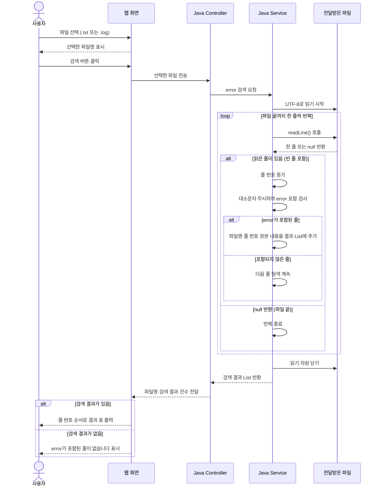

# MyProject
https://pofo.kr/ 활용가능

[error-search-sequence.md](https://github.com/user-attachments/files/33090160/error-search-sequence.md)
# 에러위키 파일 검색 시퀀스 다이어그램

## 목적

사용자가 선택한 파일에서 `error` 문자열을 검색하고, 일치한 모든 줄을 웹 페이지에 목록으로 출력한다.

## 검색 기준

| 항목 | 기준 |
|---|---|
| 파일 선택 | 사용자 PC에서 `.txt` 또는 `.log` 파일 한 개 선택 |
| 전송 | 검색 버튼을 누르면 Java 서버로 파일 전송 |
| 내용 읽기 | UTF-8 기준으로 한 줄씩 읽기 |
| 문자열 검색 | 대소문자를 무시하고 `error` 포함 여부 확인 |
| 탐색 범위 | 검색어를 발견해도 마지막 줄까지 계속 탐색 |
| 결과 단위 | 일치한 줄 한 개를 한 건으로 처리 |
| 결과 정보 | 파일명, 줄 번호, 원본 줄 내용 |
| 출력 순서 | 줄 번호 오름차순 |

`errorCode`, `errors`, `No error detected`도 포함 검색에 일치한다. 검색 건수는 실제 오류 발생 건수가 아닌, `error`가 포함된 줄의 개수이다.

## 시퀀스 다이어그램

## 구성 요소의 책임

| 구성 요소 | 책임 |
|---|---|
| 웹 화면 | 파일 선택, 파일 전송, 검색 결과 목록 표시 |
| Controller | 요청 접수, Service 호출, 결과를 화면에 전달 |
| Service | 파일 읽기, 문자열 검색, 끝까지 탐색, 결과 목록 생성 |
| 결과 DTO | 파일명, 줄 번호, 원본 줄 내용 보관 |

## 결과 화면 예시

선택 파일: `application.log` · 검색어: `error` · 검색 결과: 3건

| 번호 | 줄 번호 | 검색된 내용 |
|---|---:|---|
| 1 | 12 | ERROR 파일 복사 실패 |
| 2 | 35 | Error 데이터 저장 실패 |
| 3 | 78 | error 원본 파일 없음 |

## 예외 및 출력 처리

- 파일 읽기에 실패하면 자원을 닫고, 검색 완료 결과 대신 “파일을 읽을 수 없습니다”를 표시한다.
- 빈 줄은 파일 끝이 아니므로 탐색을 계속한다.
- 같은 내용이 서로 다른 줄에 있으면 각각 출력한다.
- 비교에만 소문자 변환을 사용하고, 출력에는 원본 내용을 사용한다.
- 파일 내용은 HTML로 해석하지 않고 일반 텍스트로 표시한다.
- 파일 영구 저장과 데이터베이스는 현재 기능에 필요하지 않다.

