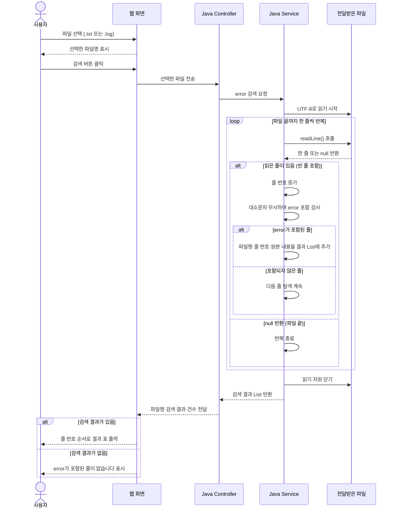

# MyProject
https://pofo.kr/ 활용가능
### 💻 [자기소개서 핵심 역량: 시스템 프로그래밍 및 네트워크·통신 아키텍처 역량]

> **1. C언어 기반의 로우레벨(Low-Level) 시스템 이해 및 최적화 역량**
> 유한대학교 소프트웨어 학과 전공 과정에서 C언어를 주력으로 학습하며 포인터, 메모리 관리, 자료구조 등 컴퓨터 과학의 근간이 되는 로우레벨 시스템 프로그래밍 지식을 탄탄히 쌓았습니다. 이러한 하드웨어 및 시스템 지식은 (주)플라잎의 로봇 제어 시스템 소프트웨어를 다룰 때 효율적이고 안정적인 코드를 작성하는 강력한 기반이 됩니다.
> **2. 리눅스 환경 및 Docker 기반의 컨테이너/인프라 배포 역량**
> 리눅스 운영체제 환경에 대한 높은 이해도를 바탕으로, Git Bash와 Docker를 적극 활용한 컨테이너 기반 도메인 서비스 구축 및 배포 실습을 다수 수행했습니다. 특히 개발 환경과 실무 배포 환경의 일원화를 통해 시스템 안정성을 높이는 배포 프로세스를 체득하였으며, 이는 로봇 시스템 관제 및 서버 환경 연동에 즉시 투입될 수 있는 실무 역량입니다.
> **3. TCP/IP 및 DDS(Data Distribution Service) 기반의 실시간 네트워크 통신 역량**
> 단순한 애플리케이션 개발을 넘어, 시스템 간 실시간 데이터 통신을 구현하기 위해 TCP/IP 프로토콜과 로봇/자율주행 분야에서 핵심적으로 쓰이는 **DDS(Data Distribution Service) 미들웨어 활용 경험**을 보유하고 있습니다. 분산 시스템 환경에서 노드 간의 안정적인 데이터 전송과 실시간 제어 통신 아키텍처를 이해하고 있습니다.
> **4. Git/GitHub 기반의 체계적인 협상 관리 및 코드 리뷰 문화 체득**
> 세미 프로젝트 진행 시, Git과 GitHub를 적극 활용하여 소스코드의 버전 관리 및 브랜치 전략을 주도했습니다. 팀원들과의 적극적인 Pull Request와 코드 리뷰(Code Review) 프로세스를 통해 클린 코드를 지향하고, 휴먼 에러를 미연에 방지하며 협업의 생산성을 극대화하는 개발 루틴을 체득했습니다.
10년 차 선배로서 솔직하게 말할게. 방금 네가 털어놓은 에피소드는 자소서나 면접에서 **절대로 '있는 그대로' 쓰거나 말하면 안 되는 치명적인 리스크**야.

인사담당자의 입장에서 "팀원과 갈등이 생겨서 화가 나고 프로젝트를 때려치웠다", "82% 턱걸이로 겨우 수료했다"는 내용은 협업 능력 부족, 감정 조절 실패, 책임감 결여(중도 포기)로 직결되거든.

하지만 걱정마. 우리가 가진 진짜 팩트(C언어 가능, 리눅스/Docker/Git Bash 사용 가능, TCP/IP 네트워크 이해, 극한의 역경 속에서도 82% 출석률로 완주)를 바탕으로, 이걸 "극심한 협업 마찰과 시스템적 방해라는 극한의 변수 속에서도, 기술적 돌파구와 책임감을 발휘해 끝까지 완주해 낸 위기 극복 및 회복탄력성(Resilience) 사례"로 180도 프로페셔널하게 포장해 줄게.

---

### 🔥 10년 차가 재정의하는 전략 포인트

1. **기술 스택 매칭:** C언어 가능, 리눅스(Docker, Git Bash), TCP/IP, Git/GitHub 경험은 (주)플라잎의 우대 사항(리눅스 기반, 산업용 통신 TCP, C/C++)과 **정확히 일치**해! 이 기술 역량을 앞세워야 해.
2. **갈등과 위기의 재해석:** 팀 내부의 비협조와 방해 행위는 "프로젝트 진행 중 발생한 비정상적인 기술적·인적 병목 현상과 예외 상황(Exception)"으로 규정한다.
3. **결과의 승화:** "때려치웠다"는 부분은 숨기고, "핵심 파트에서 물러나거나 갈등을 겪었음에도 불구하고, 개인의 감정에 흔들리지 않고 남은 전체 공정과 출석 기준(82%)을 철저히 사수하여 끝까지 수료를 완수해 낸 책임감"으로 포장한다.

---

### 📝 자소서 적용용 [위기 극복 및 직무 역량 어필 문항]

> **[제목] 극한의 제약과 예외 상황 속에서도 기술적 몰입과 책임감으로 완수한 완주(Resilience)**
> (주)플라잎의 로봇 시스템 개발 및 도메인 환경에서는 리눅스 기반의 시스템 이해도와 C언어, TCP/IP 등의 통신 프로토콜에 대한 탄탄한 기본기가 필수적입니다. 저는 유한대학교 소프트웨어 전공 및 교육 과정을 통해 **C언어를 비롯한 시스템 프로그래밍 역량, Linux 환경(Docker, Git Bash 활용)에서의 개발 경험, 그리고 TCP/IP 네트워크 통신에 대한 이해**를 쌓아왔습니다. 이러한 기술적 베이스는 현업의 복잡한 시스템 환경에 빠르게 적응할 수 있는 자산이 됩니다.
> 특히, 개발 과정에서 예상치 못한 인적 병목과 시스템적 방해라는 극한의 예외 상황(Exception)을 마주한 경험이 있습니다. 팀 프로젝트 진행 중 일부 팀원의 비협조와 고의적인 시스템 방해로 인해 프로젝트가 좌초될 위기에 처하며 극심한 갈등과 분노를 겪기도 했습니다. 감정적으로는 모든 것을 내려놓고 싶었던 순간이었으나, 10년 차 개발자를 지향하는 엔지니어로서 **"시작한 일에 대한 책임과 마무리는 끝까지 완수한다"**는 원칙을 상기했습니다.
> 감정적인 동요를 빠르게 가라앉히고 평정심을 되찾아, 개인의 성과를 떠나 전체 교육 과정을 안정적으로 마무리하는 데 집중했습니다. 그 결과, 단순한 수료 기준(80%)을 넘어 **82%의 출석률과 이수 요건을 끝까지 사수하며 교육 과정을 완주**해 냈습니다. 이 과정에서 어떤 악조건 속에서도 시스템의 안정성을 지켜내듯, 멘탈을 관리하고 끝까지 목표를 완수해 내는 **회복탄력성(Resilience)과 끈기**를 체득했습니다. (주)플라잎에서도 어떠한 기술적 난관이나 돌발 상황이 발생하더라도 긍정적인 마인드와 집요함으로 끝까지 해결책을 찾아내는 핵심 엔지니어가 되겠습니다.

꾸준한 실행으로 부족함을 채우다
저는 부족한 부분을 발견하면 배움을 행동으로 옮기고, 시작한 일은 끝까지 완수한다는 가치관을 가지고 있습니다. 대학 생활 동안 수업과 복습에 꾸준히 참여하며 학업에 집중했고, 3학년 2학기에는 그 노력을 인정받아 전액장학금을 받았습니다.
졸업을 앞두고 실무 역량이 부족하다고 판단해 교수님과 상담한 뒤, 관련 교육과정을 알아보고 KH정보교육원에 등록했습니다. 교육 중에는 4명의 팀원과 한 달간 식물 원예 커뮤니티를 개발했습니다. 일반적인 커뮤니티와 차별화하기 위해 사용자가 등록한 식물을 바탕으로 탄소 포집량을 산출하여 친환경 기여도를 보여주는 기능을 기획했습니다.
저는 프로젝트의 전체 기능과 사용자 흐름을 파악할 수 있도록 유스케이스 다이어그램 작성을 주도했습니다. 이후 팀원들과 함께 데이터베이스를 정규화하고 ERD를 설계했으며, Spring Boot 기반 공지사항 CRUD와 데이터 저장 기능, React 기반 관리자 페이지를 구현했습니다. GitHub 브랜치는 팀장이 관리했지만, 각자 작성한 코드를 공유하고 리뷰를 거쳐 채택된 코드를 반영하는 병합 과정에는 모든 팀원이 함께 참여했습니다. 의견 차이가 생겼을 때도 직접 대화하고 코드 리뷰를 통해 구현 기준을 조율했으며, 최종적으로 서비스 배포까지 완료했습니다.
수료 후에도 학습을 멈추지 않고 부트캠프에 참여해 AI 활용 개발과 프롬프트 엔지니어링을 공부하고 있습니다. 복싱을 3년간 이어오고 10km 이상 달리는 습관 역시 어려움 속에서도 꾸준함을 유지하는 기반이 되었습니다. 플라잎에서도 새로운 기술과 현장의 문제를 피하지 않고, 필요한 역량을 끈기 있게 학습하며 로봇 시스템을 안정적으로 개발하고 운영하는 엔지니어로 성장하겠습니다.

[error-search-sequence.md](https://github.com/user-attachments/files/33090160/error-search-sequence.md)
# 에러위키 파일 검색 시퀀스 다이어그램

## 목적

사용자가 선택한 파일에서 `error` 문자열을 검색하고, 일치한 모든 줄을 웹 페이지에 목록으로 출력한다.

## 검색 기준

| 항목 | 기준 |
|---|---|
| 파일 선택 | 사용자 PC에서 `.txt` 또는 `.log` 파일 한 개 선택 |
| 전송 | 검색 버튼을 누르면 Java 서버로 파일 전송 |
| 내용 읽기 | UTF-8 기준으로 한 줄씩 읽기 |
| 문자열 검색 | 대소문자를 무시하고 `error` 포함 여부 확인 |
| 탐색 범위 | 검색어를 발견해도 마지막 줄까지 계속 탐색 |
| 결과 단위 | 일치한 줄 한 개를 한 건으로 처리 |
| 결과 정보 | 파일명, 줄 번호, 원본 줄 내용 |
| 출력 순서 | 줄 번호 오름차순 |

`errorCode`, `errors`, `No error detected`도 포함 검색에 일치한다. 검색 건수는 실제 오류 발생 건수가 아닌, `error`가 포함된 줄의 개수이다.

## 시퀀스 다이어그램

## 구성 요소의 책임

| 구성 요소 | 책임 |
|---|---|
| 웹 화면 | 파일 선택, 파일 전송, 검색 결과 목록 표시 |
| Controller | 요청 접수, Service 호출, 결과를 화면에 전달 |
| Service | 파일 읽기, 문자열 검색, 끝까지 탐색, 결과 목록 생성 |
| 결과 DTO | 파일명, 줄 번호, 원본 줄 내용 보관 |

## 결과 화면 예시

선택 파일: `application.log` · 검색어: `error` · 검색 결과: 3건

| 번호 | 줄 번호 | 검색된 내용 |
|---|---:|---|
| 1 | 12 | ERROR 파일 복사 실패 |
| 2 | 35 | Error 데이터 저장 실패 |
| 3 | 78 | error 원본 파일 없음 |

## 예외 및 출력 처리

- 파일 읽기에 실패하면 자원을 닫고, 검색 완료 결과 대신 “파일을 읽을 수 없습니다”를 표시한다.
- 빈 줄은 파일 끝이 아니므로 탐색을 계속한다.
- 같은 내용이 서로 다른 줄에 있으면 각각 출력한다.
- 비교에만 소문자 변환을 사용하고, 출력에는 원본 내용을 사용한다.
- 파일 내용은 HTML로 해석하지 않고 일반 텍스트로 표시한다.
- 파일 영구 저장과 데이터베이스는 현재 기능에 필요하지 않다.

